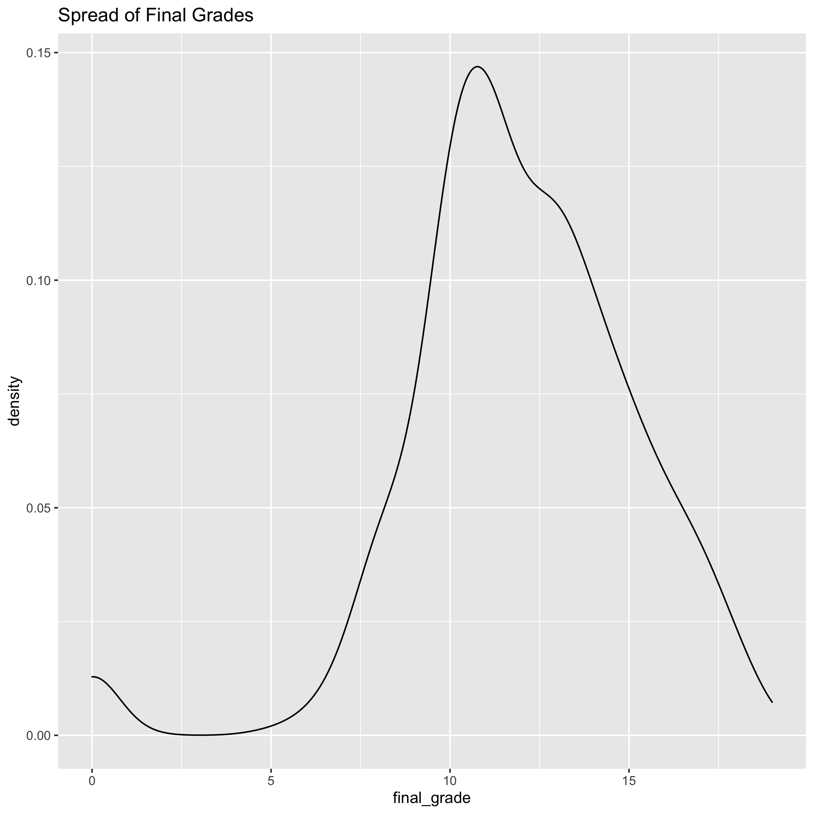

```{r setup, include=FALSE}
suppressPackageStartupMessages(library(tidyverse))
suppressPackageStartupMessages(library(glue))
library(here)
knitr::opts_chunk$set(echo = TRUE)
suppressPackageStartupMessages(library(broom))
```

## Introduction:

Alcohol use has been linked with cognitive impairement in the short term in a variety of situations such as in operation of a motor vehicle. Numerous factors have been found to affect a student's performance in a class, from sleep to diet.One previous study has shown the negative affect of alcohol on academic achievement in a student dataset from the United States [1](https://www.ncbi.nlm.nih.gov/pmc/articles/PMC3026599/).  Thus, it would be interesting to see if this affect on performance can be replicated in other datasets and whether time of alcohol consumption (weekend or weekday) makes a difference. 
 
## Data Description
The datasets are obtained from UCI  and is originally from Fabio Pagnotta and Hossain Mohammad Amran. It contains survey data from Portugese highschool students in a Math and Portugese class and contains information on 33 attributes. Each class is its own .csv file, but I will be focussing on the attributes from the Portugese class dataset as it contains more students (649 students). Each student makes up each row. 
This was generated from a colon separated file I made from the original txt metadata file.

Below is the entire variable set:

```{r}
meta_dat <- read.delim((here("data","student_metadata.txt")),sep = ";", header=FALSE)
colnames(meta_dat) <- c("variable","description","type")
levels(meta_dat$variable)
 (variable==if_else(G1,t1_grade,t2_grade=G2,final_grade=G3,mom_job=Mjob,
           dad_job=Fjob,weekend_alc=Walc,workday_alc=Dalc,mom_edu=Medu,dad_edu=Fedu,parent_status=Pstatus,
           family_relations=famrel,fam_support=famsup) 
 write.table(meta_dat,here("data","student_metadata1.txt"))
knitr:::kable(meta_dat, format="markdown")
```

## Data Exploration: 

### Correllogram

```{r echo=FALSE}
knitr::include_graphics(here("images","Correllogram.png"))
```
{width=80%}

In this correllogram, we see a variety of factors having an association with final grades . The colour scheme shows all positive correlations as blue, and all negative correlations as red.Term 1 grades(t1_grades) and term 2 grades(t2_grades) having the highest correlation with final_grades makes sense here, as earlier term grades are correlated with later term grades. We will mainly focus on the alcohol (workday and weekend), which show negative correlation.


### Boxplots

Let's look at weekend alcohol and workday alcohol use's spread.

```{r echo=FALSE}
knitr::include_graphics(here("images","Final Grade vs Weekend Alcohol.png"))

```
{width=80%}\ {width=80%}


We see differences in the spread from the very low(1) to very high (5) consumption, with a general decrease in the mean as the amount of alcohol consumption increases increases, especially in the workday consumption.

### Density Plots
Let's look at the distribution of grades.

{width=80%}


The distribution of grades appear to be a bit left skewed. 

#### Other variables that may affect data
Let's look at potential confounding factors like sex of the student, parental status and family support and their spread in average final grades

#####"Potential Confounding factors and grades"

{width=80%}\ {width=80%} 
{width=80%}\ {width=80%} 
{width=80%} 


It doesn't look like there is a huge difference between the grades in males compared to females. Males have a slighly lower average, but overall are similar. This is good because it will not be a huge confound in the data.Also family support and parental status have similar average values. 

## Research Question:

In this analysis, I will use linear regression to determine the relationship between alcohol use, either weekend, weekday (workday) or both and final grades (G3) for students. I chose the final grades as a output variable because it is more resistant to short term effects because it depends on work throughout the term. 


## Plan of Action:

I will remove those with very bad health status (1), as to reduce confounds in the data. My main focus is on the alcohol use categories and final grades, so I will probably ignore the other factors.I will then perform linear regression analysis and plot a regression line using the relevant variables. 

## Methods
I performed a multivariate simple linear regression using the lm package, after removing the very bad health status(1). I used workday alcohol and weekend alcohol as covariates and looked at interaction between these 2 as well. 
```{r}
lm_model <- readRDS(here("data","lm_model_alc.RDS"))
```


## Results
Let's look at our linear model results.
```{r}
tidy_lm_model <- tidy(lm_model)
tidy_lm_model
glance(lm_model)
```

The only result that seems to be significant is the workday alcohol with grades. The interaction term is not significant, thus we can point that workday alcohol affects grades as a main effect. There appprea


### Residual Plots:
Let's look at qqplots of the residulat and residual vs fitted plots. 

{width=80%}\ {width=80%}


The residuals do not all fall onto the qqplot and thus are not fully normally distributed. 

## Discussion/Conclusions
The only predictor variable that was significant was workday alcohol which had a negative association with final grades(. This is in line with Balsa et al.'s study, which saw a significant, but small negative association with alcohol and grades, specifically for males. In my case, I did not separate by gender, which could be a future analysis. Also, I think including other covariates like family support in the future would be a good idea. Finally, given the qqplot, it would be best to potentially change the model from a simple linear regression that treats the predictor of alcohol use as a numeric, into a more complex model that treats this predictor as a categorical and uses dummy variables.  
