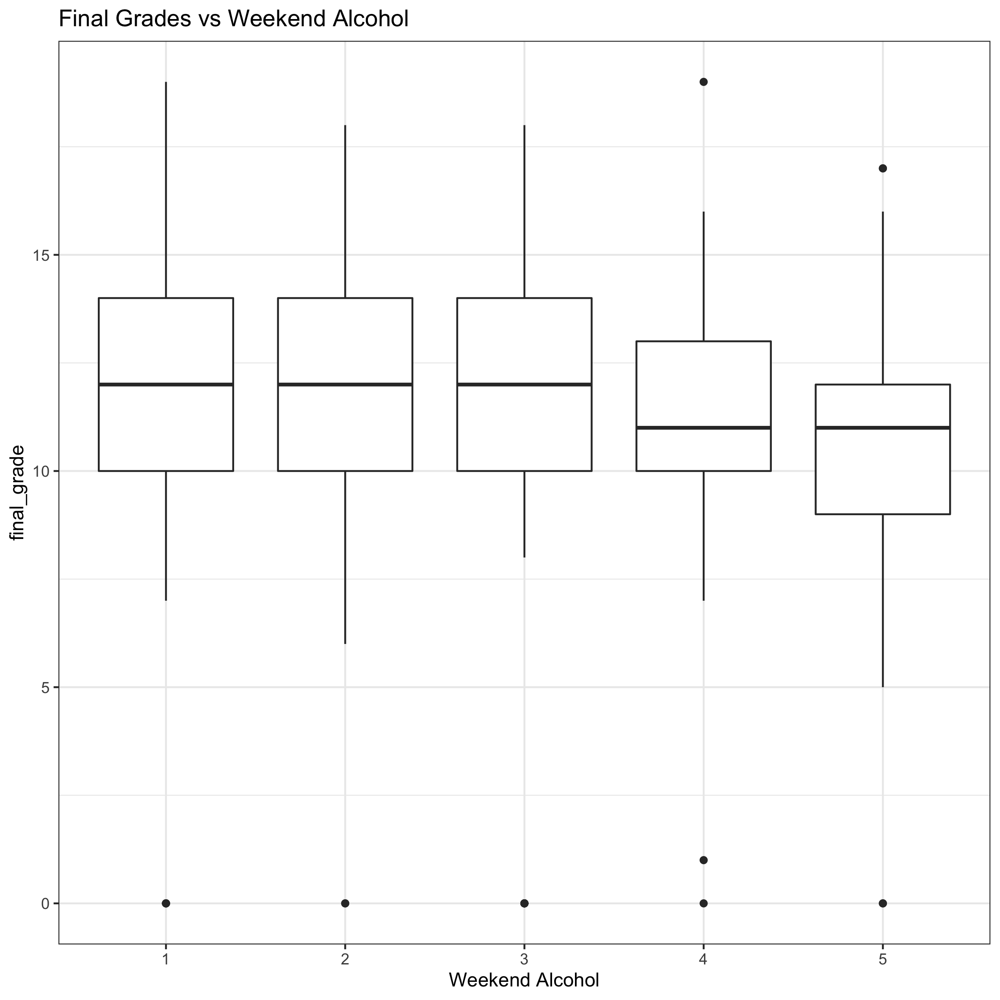
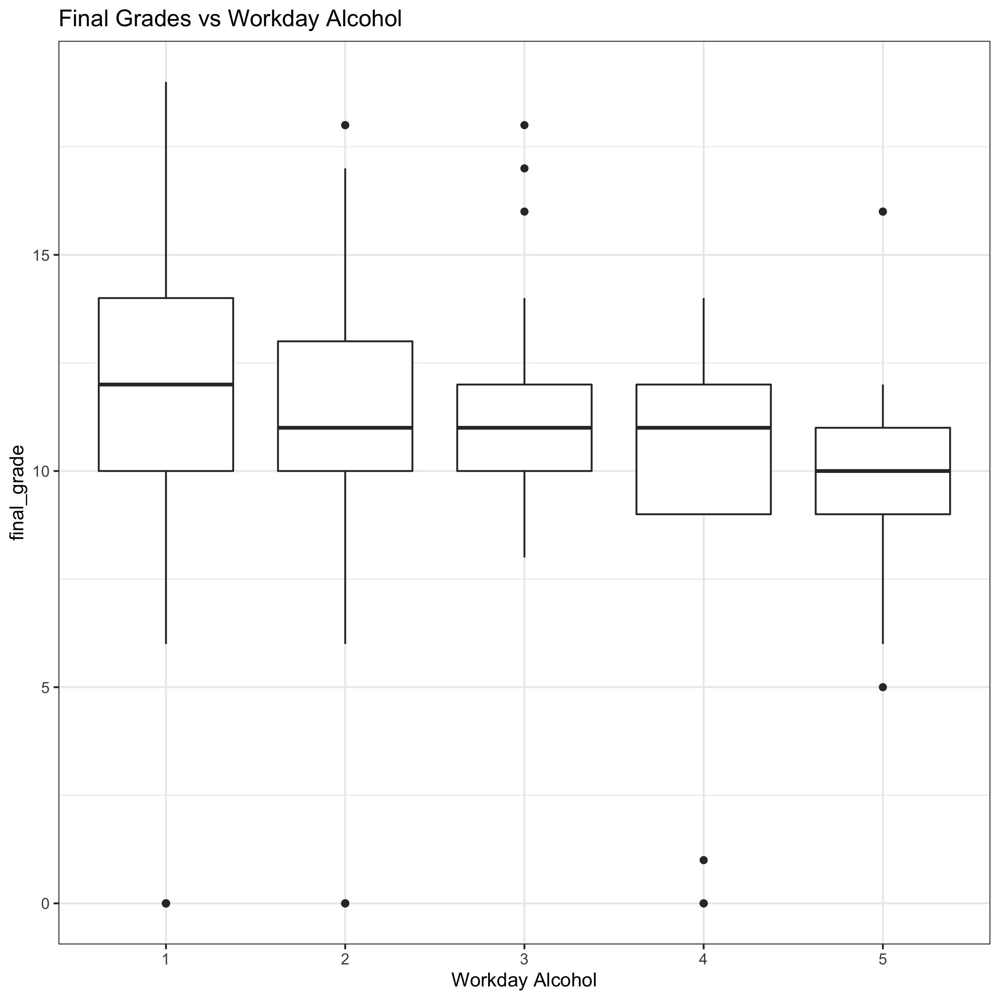
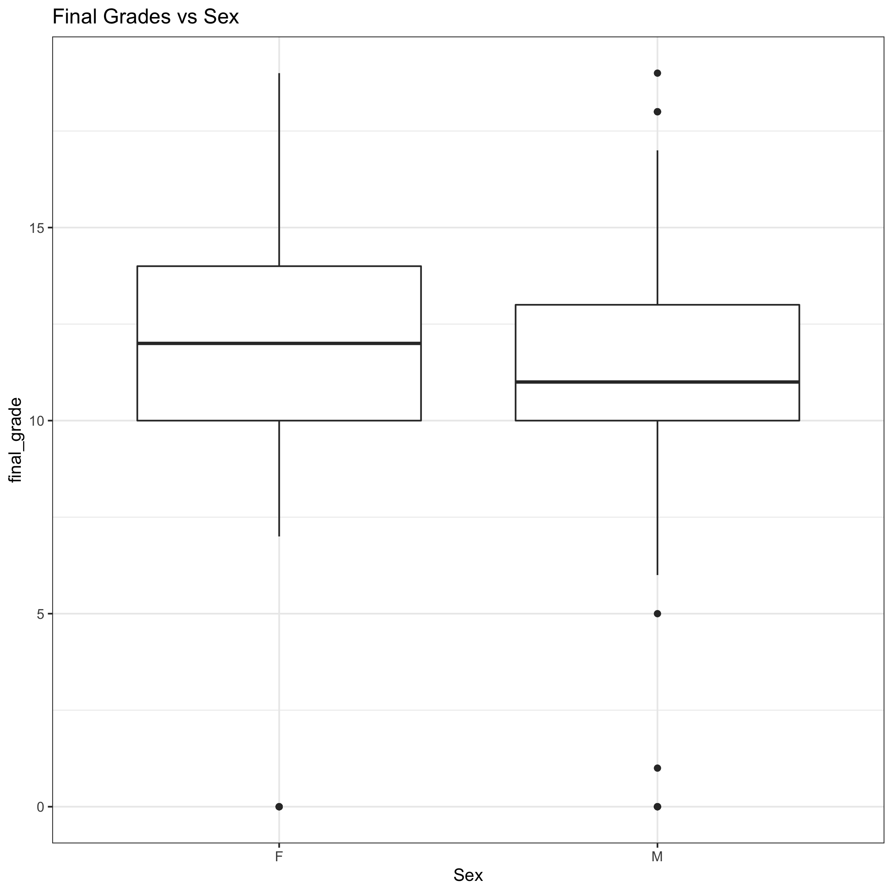
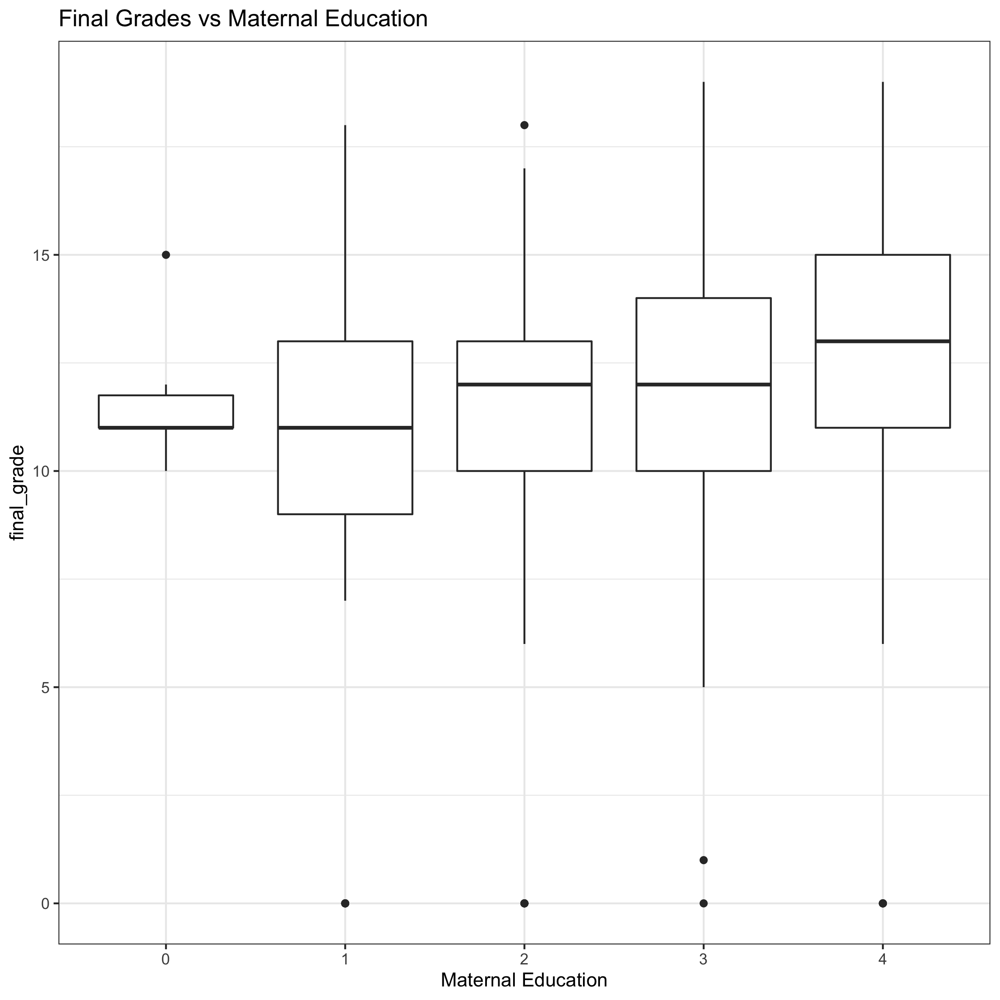
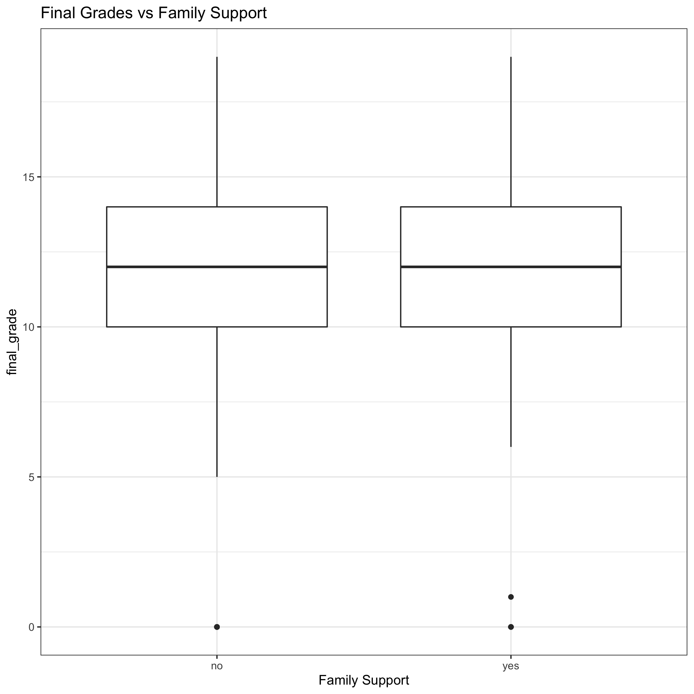
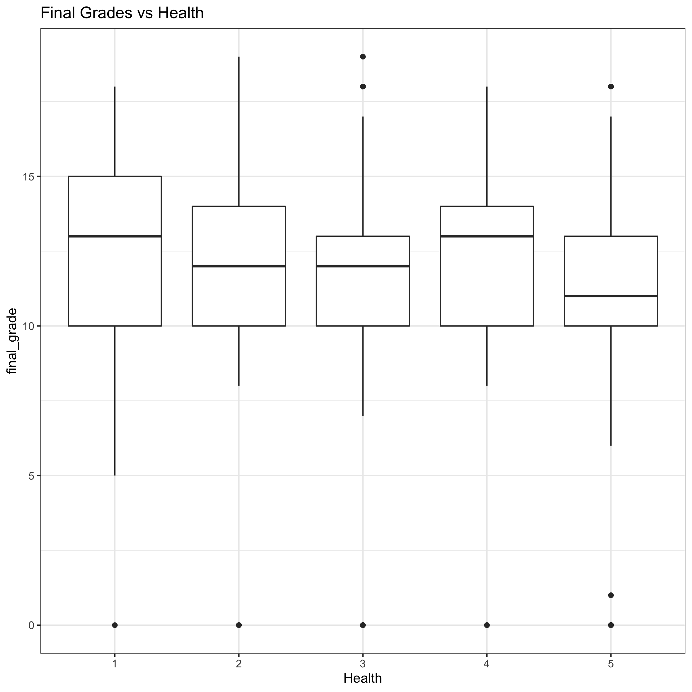

```{r setup, include=FALSE}
suppressPackageStartupMessages(library(tidyverse))
suppressPackageStartupMessages(library(glue))
suppressPackageStartupMessages(library(corrplot))
suppressPackageStartupMessages(library(purrr))
library(here)
knitr::opts_chunk$set(echo = TRUE)
```

## Introduction:

Alcohol use has been linked with cognitive impairement in the short term in a variety of situations such as in operation of a motor vehicle. Numerous factors have been found to affect a student's performance in a class, from sleep to diet.One previous study has shown the negative affect of alcohol on academic achievement in a student dataset from the United States [1](https://www.ncbi.nlm.nih.gov/pmc/articles/PMC3026599/).  Thus, it would be interesting to see if this affect on performance can be replicated in other datasets and whether time of alcohol consumption (weekend or weekday) makes a difference. 
 
## Data Description
The datasets are obtained from UCI  and is originally from Fabio Pagnotta and Hossain Mohammad Amran. It contains survey data from Portugese highschool students in a Math and Portugese class and contains information on 33 attributes. Each class is its own .csv file, but I will be focussing on the attributes from the Portugese class dataset as it contains more students (649 students). Each student makes up each row. 
This was generated from a colon separated file I made from the original txt metadata file.

Below is the entire variable set:

```{r}
meta_dat <- read.delim((here("data","student_metadata.txt")),sep = ";", header=FALSE)
colnames(meta_dat) <- c("variable","description","type")
knitr:::kable(meta_dat, format="markdown")
```

## Data Exploration: 

### Correllogram

```{r}

```


)

In this correllogram, we see a variety of factors having an association with final grades (G3). The colour scheme shows all positive correlations as blue, and all negative correlations as red.G1 and G2 having the highest correlation with G3 makes sense here, as earlier term grades are correlated with later term grades. We will mainly focus on the alcohol (Dalc and Walc), which show negative correlation.

### Boxplots

Let's look at weekend alcohol and workday alcohol use's spread.

 


We see differences in the spread from the very low(1) to very high (5) consumption, with a general decrease in the mean as the amount of alcohol consumption increases increases, especially in the workday consumption.

### Density Plots
Let's look at the distribution of grades.


The distribution of grades appear to be a bit left skewed. 

#### Other variables that may affect data
Let's look at potential confounding factors like sex of the student, parental status and family support and their spread in average final grades

#####"Potential Confounding factors and grades"

  
  
 


It doesn't look like there is a huge difference between the grades in males compared to females. Males have a slighly lower average, but overall are similar. This is good because it will not be a huge confound in the data.Also family support and parental status have similar average values. 

## Research Question:

In this analysis, I will use linear regression to determine the relationship between alcohol use, either weekend, weekday (workday) or both and final grades (G3) for students. I chose the final grades as a output variable because it is more resistant to short term effects because it depends on work throughout the term. 


## Plan of Action:

I will remove those with very bad health status (1), as to reduce confounds in the data. My main focus is on the alcohol use categories and final grades, so I will probably ignore the other factors.I will then perform linear regression analysis and plot 
a regression line using the relevant variables. 

## Methods


## Results

## Discussion/Conclusions
