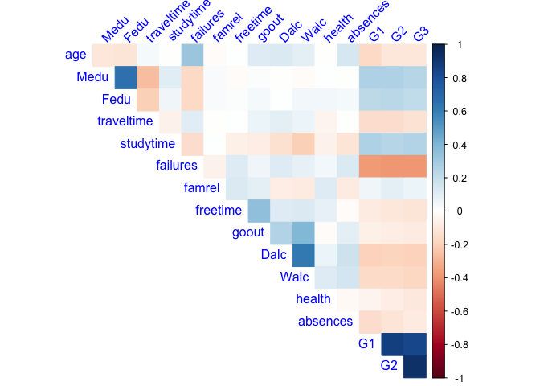
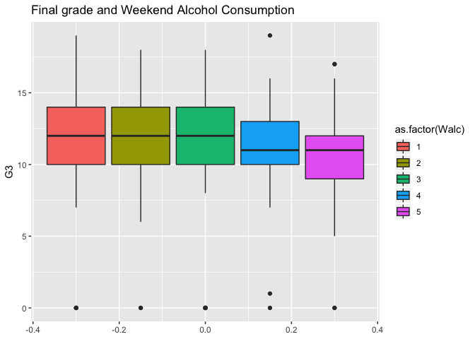
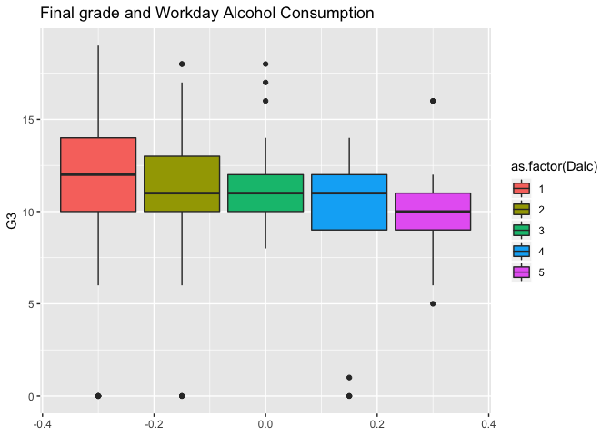
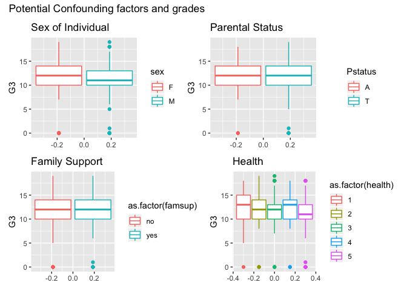

# Alcohol Use and Association with Final Grades 


```r
library(tidyverse)
```

```
## ── Attaching packages ─────────────────────────────────────────────────────────────────────────────────────────── tidyverse 1.3.0 ──
```

```
## ✓ ggplot2 3.2.1     ✓ purrr   0.3.3
## ✓ tibble  2.1.3     ✓ dplyr   0.8.4
## ✓ tidyr   1.0.2     ✓ stringr 1.4.0
## ✓ readr   1.3.1     ✓ forcats 0.4.0
```

```
## ── Conflicts ────────────────────────────────────────────────────────────────────────────────────────────── tidyverse_conflicts() ──
## x dplyr::filter() masks stats::filter()
## x dplyr::lag()    masks stats::lag()
```

```r
library(here)
```

```
## here() starts at /Users/almas/Documents/GitHub/Stat547_class/Project/team11_akhan
```

```r
library(knitr)
library(corrplot)
```

```
## corrplot 0.84 loaded
```

```r
library(patchwork)
```

## Introduction:

Alcohol use has negatively been linked with performance in different situations due to its depressive 

## Data Description
The datasets are obtained from UCI  and is originally from Fabio Pagnotta and Hossain Mohammad Amran. It contains survey data from Portugese highschool students in a Math and Portugese class and contains information on 33 attributes. Each class is its own .csv file, but I will be focussing on the attributes from the Portugese class dataset as it contains more students (649 students). Each student makes up each row. Below is the entire variable set:
This was generated from a colon separated file I made from the original txt metadata file.


```r
meta_dat <- read.delim((here("data","student_metadata.txt")),sep = ";", header=FALSE)
colnames(meta_dat) <- c("variable","description","type")
knitr:::kable(meta_dat)
```


variable     description                                                         type                                                                                                                                   
-----------  ------------------------------------------------------------------  ---------------------------------------------------------------------------------------------------------------------------------------
school       student's school                                                    binary: GP for Gabriel Pereira or MS for Mousinho da Silveira                                                                          
sex          student's sex                                                       binary: F for female or M for male                                                                                                     
age          student's age                                                       numeric: from 15 to 22                                                                                                                 
address      student's home address type                                         binary: U for urban or R for rural                                                                                                     
famsize      family size                                                         binary: LE3 for less or equal to 3 or GT3 for greater than 3                                                                           
Pstatus      parent's cohabitation status                                        binary: T for living together or A for apart                                                                                           
Medu         mother's education                                                  numeric: 0 for none,  1 for primary education (4th grade), 2 for 5th to 9th grade, 3 for secondary education or 4 for higher education 
Fedu         father's education                                                  numeric: 0 for none,  1 for primary education (4th grade), 2 for 5th to 9th grade, 3 for secondary education or 4 for higher education 
Mjob         mother's job                                                        nominal: teacher, health care related, civil services (e.g. administrative or police), at_home or other                                
Fjob         father's job                                                        nominal: teacher, health care related, civil services (e.g. administrative or police), at_home or other                                
reason       reason to choose this school                                        nominal: close to home, school reputation, course preference or other                                                                  
guardian     student's guardian                                                  nominal: mother, father or other                                                                                                       
traveltime   home to school travel time                                          numeric: 1 for <15 min., 2 for 15 to 30 min., 3 for 30 min. to 1 hour, or 4 for >1 hour                                                
studytime    weekly study time                                                   numeric: 1 for <2 hours, 2 for 2 to 5 hours, 3 for 5 to 10 hours, or 4 for >10 hours                                                   
failures     number of past class failures                                       numeric: n if 1<=n<3, else 4                                                                                                           
schoolsup    extra educational support                                           binary: yes or no                                                                                                                      
famsup       family educational support                                          binary: yes or no                                                                                                                      
paid         extra paid classes within the course subject (Math or Portuguese)   binary: yes or no                                                                                                                      
activities   extra-curricular activities                                         binary: yes or no                                                                                                                      
nursery      attended nursery school                                             binary: yes or no                                                                                                                      
higher       wants to take higher education                                      binary: yes or no                                                                                                                      
internet     Internet access at home                                             binary: yes or no                                                                                                                      
romantic     with a romantic relationship                                        binary: yes or no                                                                                                                      
famrel       quality of family relationships                                     numeric: from 1 for very bad to 5 for excellent                                                                                        
freetime     free time after school                                              numeric: from 1 for very low to 5 for very high                                                                                        
goout        going out with friends                                              numeric: from 1 for very low to 5 for very high                                                                                        
Dalc         workday alcohol consumption                                         numeric: from 1 for very low to 5 for very high                                                                                        
Walc         weekend alcohol consumption                                         numeric: from 1 for very low to 5 for very high                                                                                        
health       current health status                                               numeric: from 1 for very bad to 5 for very good                                                                                        
absences     number of school absences                                           numeric: from 0 to 93                                                                                                                  
G1           first period grade                                                  numeric: from 0 to 20                                                                                                                  
G2           second period grade                                                 numeric: from 0 to 20                                                                                                                  
G3           final grade                                                         numeric: from 0 to 20, output target                                                                                                   


## Exploring the Dataset

### Load data


```r
library(here)
stu_por <-read.csv(here("data","student-por.csv"),sep=";")
any(is.na(stu_por)) # checks for missing values
```

```
## [1] FALSE
```

```r
str(stu_por)
```

```
## 'data.frame':	649 obs. of  33 variables:
##  $ school    : Factor w/ 2 levels "GP","MS": 1 1 1 1 1 1 1 1 1 1 ...
##  $ sex       : Factor w/ 2 levels "F","M": 1 1 1 1 1 2 2 1 2 2 ...
##  $ age       : int  18 17 15 15 16 16 16 17 15 15 ...
##  $ address   : Factor w/ 2 levels "R","U": 2 2 2 2 2 2 2 2 2 2 ...
##  $ famsize   : Factor w/ 2 levels "GT3","LE3": 1 1 2 1 1 2 2 1 2 1 ...
##  $ Pstatus   : Factor w/ 2 levels "A","T": 1 2 2 2 2 2 2 1 1 2 ...
##  $ Medu      : int  4 1 1 4 3 4 2 4 3 3 ...
##  $ Fedu      : int  4 1 1 2 3 3 2 4 2 4 ...
##  $ Mjob      : Factor w/ 5 levels "at_home","health",..: 1 1 1 2 3 4 3 3 4 3 ...
##  $ Fjob      : Factor w/ 5 levels "at_home","health",..: 5 3 3 4 3 3 3 5 3 3 ...
##  $ reason    : Factor w/ 4 levels "course","home",..: 1 1 3 2 2 4 2 2 2 2 ...
##  $ guardian  : Factor w/ 3 levels "father","mother",..: 2 1 2 2 1 2 2 2 2 2 ...
##  $ traveltime: int  2 1 1 1 1 1 1 2 1 1 ...
##  $ studytime : int  2 2 2 3 2 2 2 2 2 2 ...
##  $ failures  : int  0 0 0 0 0 0 0 0 0 0 ...
##  $ schoolsup : Factor w/ 2 levels "no","yes": 2 1 2 1 1 1 1 2 1 1 ...
##  $ famsup    : Factor w/ 2 levels "no","yes": 1 2 1 2 2 2 1 2 2 2 ...
##  $ paid      : Factor w/ 2 levels "no","yes": 1 1 1 1 1 1 1 1 1 1 ...
##  $ activities: Factor w/ 2 levels "no","yes": 1 1 1 2 1 2 1 1 1 2 ...
##  $ nursery   : Factor w/ 2 levels "no","yes": 2 1 2 2 2 2 2 2 2 2 ...
##  $ higher    : Factor w/ 2 levels "no","yes": 2 2 2 2 2 2 2 2 2 2 ...
##  $ internet  : Factor w/ 2 levels "no","yes": 1 2 2 2 1 2 2 1 2 2 ...
##  $ romantic  : Factor w/ 2 levels "no","yes": 1 1 1 2 1 1 1 1 1 1 ...
##  $ famrel    : int  4 5 4 3 4 5 4 4 4 5 ...
##  $ freetime  : int  3 3 3 2 3 4 4 1 2 5 ...
##  $ goout     : int  4 3 2 2 2 2 4 4 2 1 ...
##  $ Dalc      : int  1 1 2 1 1 1 1 1 1 1 ...
##  $ Walc      : int  1 1 3 1 2 2 1 1 1 1 ...
##  $ health    : int  3 3 3 5 5 5 3 1 1 5 ...
##  $ absences  : int  4 2 6 0 0 6 0 2 0 0 ...
##  $ G1        : int  0 9 12 14 11 12 13 10 15 12 ...
##  $ G2        : int  11 11 13 14 13 12 12 13 16 12 ...
##  $ G3        : int  11 11 12 14 13 13 13 13 17 13 ...
```


### Correllogram

```r
student_cor <- stu_por%>%
  select_if(is.numeric) %>% # select numeric values
  sapply(as.double) %>% # convert to double
  cor() # run correlation

student_cor<- round(student_cor,2)
corr <- corrplot(student_cor, 
         type="upper", 
         method="color",
         tl.srt=45, 
         tl.col = "blue",
         diag = FALSE) 
```

<!-- -->

G1 and G2 having the highest correlation with G3 makes sense here, as earlier term grades are correlated with later term grades.


### Boxplots
Let's look at weekend alcohol and workday alcohol use's spread.


```r
walcstu_box <- stu_por %>%
  ggplot(aes(y=G3,group=Walc,fill=as.factor(Walc))) +
  geom_boxplot()+ 
  ggtitle("Final grade and Weekend Alcohol Consumption")

dalcstu_box <- stu_por %>%
  ggplot(aes(y=G3,group=Dalc,fill=as.factor(Dalc))) +
  geom_boxplot()+
   ggtitle("Final grade and Workday Alcohol Consumption")

dalcstu_box 
```

<!-- -->

```r
walcstu_box
```

<!-- -->


### Density Plots
Let's look at the distribution of grades.

```r
 # Let's look at the distribution of grades
    stu_por %>%
  ggplot(aes(x=G3)) +
  geom_density()+
  ggtitle("Spread of Final Grades")
```

<!-- -->

The distribution of grades appear to be a bit left skewed. 

#### Other variables that may affect data
Let's look at potential confounding factors like sex of the student, parental status and family support and their spread in average final grades

```r
Sex_grades <- stu_por %>%
  ggplot(aes(y=G3,col=sex)) +
  geom_boxplot()+
  ggtitle("Sex of Individual")

Pstat_grades <-  stu_por %>%
  ggplot(aes(y=G3,col=Pstatus)) +
  geom_boxplot()+
  ggtitle('Parental Status')

Famsup_grades <-  stu_por %>%
  ggplot(aes(y=G3,col=as.factor(famsup))) +
  geom_boxplot()+
  ggtitle('Family Support')

health_stat_grades <-  stu_por %>%
  ggplot(aes(y=G3,col=as.factor(health))) +
  geom_boxplot()+
  ggtitle('Health')

(Sex_grades+Pstat_grades)/(Famsup_grades+health_stat_grades) +
 plot_annotation(title="Potential Confounding factors and grades")
```

<!-- -->

It doesn't look like there is a huge difference between the grades in males compared to females. Males have a slighly lower average, but overall are similar. This is good because it will not be a huge confound in the data.Also family support and parental status have similar average values. 

## Research Question:

In this analysis, I will use linear regression to determine the relationship between alcohol use, either weekend, weekday (workday) or both and final grades (G3) for students. I chose the final grades as a output variable because it is more resistant to short term effects because it depends on work throughout the term. 


## Plan of Action:

I will remove those with very bad health status (1), as to reduce confounds in the data. My main focus is on the alcohol use categories and final grades, so I will probably ignore the other factors.I will then perform linear regression analysis and plot 
a regression line using the relevant variables. 


